# srv6-dci

[](https://github.com/mwindower/srv6-dci/actions/workflows/ci.yaml)
[](LICENSE)

**Stitch EVPN tenant VRFs across independent EVPN/VXLAN domains using SRv6 L3VPN.**

`srv6-dci` turns an existing FRR-based EVPN VTEP, e.g. a [metal-stack](https://metal-stack.io)
firewall, into a DCI gateway:
- tenant VRFs are exported as VPNv4/v6 with an SRv6 End.DT46 SID
- remote routes come back as EVPN type-5
- each partition keeps its own VNIs, RTs and ASNs

It only **augments** the VTEP. It creates no VRFs, never rewrites `frr.conf`, and puts its
additions back whenever the base system reloads its config.

> **Status: experimental.** Tested end to end in a [containerlab lab](lab/README.md) that
> runs in CI. Redundancy and RT hygiene are next on the [roadmap](docs/development.md#roadmap).

<p align="center">
  
</p>

Between partitions only IPv6 is needed: exits and core see one locator prefix per gateway,
and nothing of tenants or VNIs. The SRv6 transport runs in one of two modes, which can be
mixed freely:

| Mode | SRv6 transport | Fits |
|---|---|---|
| DCI network (`transport.vrf`) | in an EVPN VRF, over VXLAN through the fabric | metal-stack firewalls: the DCI network is just another metal-stack network |
| Default VRF | in the IPv6 underlay | gateways with their own routed uplink |

## Quick start

```yaml
# /etc/srv6-dci/config.yaml
gateway:
  locator: fd00:dc1:a::/48        # this gateway; its loopback is fd00:dc1:a::1
  locatorBlock: fd00:dc1::/32     # all gateways' locators
transport:
  vrf: vrf104100                  # DCI network; omit for the default VRF
peers:
  - {address: "fd00:dc1:b::1", asn: 4200000022}
networks:
  - {vrf: vrf3981, routeTarget: "65535:1001"}
```

```sh
srv6-dci validate -c /etc/srv6-dci/config.yaml
srv6-dci render   -c /etc/srv6-dci/config.yaml   # the FRR lines it will add
srv6-dci run      -c /etc/srv6-dci/config.yaml   # reconcile continuously
srv6-dci status   -c /etc/srv6-dci/config.yaml
```

## Documentation

| | |
|---|---|
| [Installation](docs/installation.md) | binary + systemd, container, metal-stack notes |
| [Configuration](docs/configuration.md) | all fields, validation, requirements per mode |
| [Operation](docs/operation.md) | commands, `status`, what exactly is changed in kernel and FRR |
| [Adding partitions and networks](docs/day2.md) | what changes where, route targets, keeping locations in sync |
| [Lab](lab/README.md) | the containerlab lab and its e2e tests |
| [Routing tables](docs/lab-routing.md) | which node knows which routes, in both modes |
| [Development](docs/development.md) | layout, tests, CI, releases, roadmap |
| Design findings | [Phase 0](docs/phase0-findings.md): EVPN ↔ SRv6 feasibility, RT behaviour · [Phase 0b](docs/phase0b-findings.md): the firewall and DCI network design |

## License

[MIT](LICENSE)
