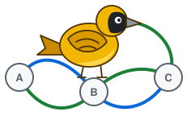

# open-dci

<p align="center">
  
</p>

[](https://github.com/mwindower/open-dci/actions/workflows/ci.yaml)
[](LICENSE)

**Stitch EVPN tenant VRFs across independent EVPN/VXLAN domains using SRv6 L3VPN.**

`open-dci` turns an FRR-based Linux box at the exit of an EVPN fabric, e.g. a
[metal-stack](https://metal-stack.io) partition, into a DCI gateway:
- it provisions the tenant VRFs as EVPN L3VNIs (VRF, bridge, VXLAN device) with the
  tenant's VNI in that partition, so the fabric sees an ordinary VTEP
- the VRFs are exported as VPNv4/v6 with an SRv6 End.DT46 SID
- remote routes come back as EVPN type-5
- each partition keeps its own VNIs, RTs and ASNs

It never rewrites `frr.conf`. It adds its lines via `vtysh` to the gateway's base config
and puts them back whenever the base system reloads its config.

## Why open-dci

Like the weaver bird, which weaves many threads into one nest, open-dci weaves each
tenant's networks from independent fabrics into one.

- **One network per tenant, across all your sites.** Every partition keeps its own EVPN
  fabric, VNIs, route targets and ASNs. open-dci joins a tenant's networks into one routed
  network, IPv4 and IPv6, and keeps tenants apart from each other.
- **No fabric surgery.** The gateways join the fabric like any VTEP. Leaves and spines stay
  as they are, and the network between the sites only needs plain IPv6.
- **Stock Linux and FRR.** No custom data plane, no special hardware: SRv6 in the Linux
  kernel, BGP in FRR, on any server.
- **Fails gracefully, maintains losslessly.** Anycast gateway pairs, dual-attached to two
  exits, with BFD: losing a gateway or an exit costs well under a second. `open-dci drain`
  takes a gateway out without losing a single packet, and a gateway that can't forward
  withdraws itself ([measured](docs/performance.md)).
- **Safe by default.** Prefix allowlists per network, route-target filters and prefix
  limits per peer, and an SRv6 domain closed at its edge.
- **Hands-off.** One YAML file per gateway. open-dci reconciles continuously, survives
  config reloads of the base system and reports its health in `status`.

**Use cases**
- A tenant's private networks in several [metal-stack](https://metal-stack.io) partitions
  or datacenters, routed as one.
- Availability zones with independent fabrics and failure domains, connected per tenant.
- Fabrics with different VNI, route-target or ASN plans joined without renumbering, e.g. during a migration.
- Many isolated tenants over one shared IPv6 core.

> [!WARNING]
> **Alpha.** open-dci is at an alpha stage: configuration and behaviour may still change
> incompatibly, and it is not ready for production. It is tested end to end in a
> [containerlab lab](lab/README.md) that runs in CI.
>
> **L3 stitching only.** Tenant IP prefixes are routed between partitions (EVPN type-5 ↔
> VPNv4/v6). **L2 is not supported**: no stretched subnets, no MAC/IP (type-2) routes, no
> L2VNIs across partitions.

<p align="center">
  
</p>

How a packet travels (per partition, the two exits, the gateway pair and the fabric are one box each):

<p align="center">
  
</p>

Between partitions only IPv6 is needed: exits and core see one locator prefix per gateway,
and nothing of tenants or VNIs. The SRv6 transport runs in one of two modes, which can be
mixed freely:

| Mode | SRv6 transport | Isolation from the fabric | Fits |
|---|---|---|---|
| DCI network (`transport.vrf`), **recommended** | in an EVPN VRF of the base config, over VXLAN through the fabric | by construction: the VRF only exists on gateways and exits | any setup, especially fabrics with untrusted devices in the underlay (e.g. tenant firewalls) |
| Default VRF | in the IPv6 underlay | by configuration: the exits must announce locators only to gateways and core, and filter the edge | gateways with their own routed uplink; no VXLAN overhead (−50 B) and no veth |

## Design Decisions

- **L3 only, SRv6 L3VPN between domains.** Stretching EVPN would couple the partitions'
  VNIs, RTs, ASNs and failure domains. Exchanging only type-5 prefixes as VPNv4/v6 keeps
  every EVPN domain independent. The inter-partition network needs nothing but IPv6 and
  one locator prefix per gateway: no tenant state, no VNIs, no MPLS.
- **Why SRv6 rather than MPLS labels.** MPLS L3VPN would work the same way at the BGP
  level. But a label needs a transport: either the core runs MPLS (LDP or SR-MPLS), coupling
  it to the partitions, or the label is tunnelled in GRE or UDP. That means tunnel devices
  per remote gateway pair, set up outside FRR on Linux. With SRv6, the address is the
  tunnel and the label at once: the SID `fd00:dc1:b:fab::` routes to pair B and selects the
  tenant VRF.
  - The core is plain IPv6 and learns one prefix per partition.
  - Redundancy is two gateways announcing the same locator (anycast), and ECMP hashes the
    IPv6 flow label.
  - The kernel's End.DT46 serves IPv4 and IPv6 with one SID per VRF.
  - Securing the domain means ACLs on one prefix block.

  The costs: 48 B per packet (VXLAN: 50 B), SIDs that decapsulate anything that reaches
  them (hence the [edge filtering](docs/operation.md#the-srv6-domain-and-its-edge)), and few
  switch chips that terminate SRv6. Only the Linux gateways terminate it; the core just
  forwards IPv6.
- **Stock FRR and the Linux kernel.** End.DT46 in the kernel and FRR's EVPN ↔ VPN
  re-origination already do the job ([Phase 0](docs/phase0-findings.md)). No custom
  data plane means nothing to maintain beyond configuration.
- **Dedicated, provider-owned gateways.** Only these boxes speak VPN and SRv6, so tenants
  never reach a SID or the transport, and a few stable nodes per partition keep locators
  and peers static ([day-2 operations](docs/day2.md)). The gateway joins the fabric like
  any VTEP; the fabric needs no changes beyond passing the tenant VNIs' routes.
- **Redundancy by anycast.** Both gateways of a partition own the same locator and SIDs.
  Remote gateways don't need to know which one is alive: the transport delivers to
  whichever is reachable, so a failure needs no BGP reconvergence of the VPN routes.
- **Why not on the switches?**
  The stitching could run on the exits or leaves themselves (SONiC uses FRR, too). open-dci
  deliberately puts it on dedicated Linux gateways:

  - **Data-plane support.** End.DT46 decap plus SRv6 encap with VPN SIDs, in the same box as
    EVPN/VXLAN, needs ASIC support. Many datacenter switch ASICs don't support SRv6 VPN at all
    or only in recent generations, and SONiC's SRv6 support covers only some platforms. The
    Linux kernel supports it on any server.
  - **Hardware tables.** On a switch, every tenant VRF, L3VNI, VXLAN tunnel and SRv6 encap
    entry competes for fixed tables (VRF IDs, next hops, tunnel and TCAM entries, shared LPM
    space). Depending on the ASIC, VRFs are typically limited to hundreds or a few thousand.
    Stitching N tenants across partitions adds N VRFs plus their remote routes to every
    switch that does it. A server's limits are memory and CPU, and are easy to grow.
  - **Blast radius and ownership.** The exits carry the whole partition's fabric and
    internet traffic and are managed by the fabric's own tooling (e.g. metal-core). Putting
    per-tenant DCI state on them couples every tenant change to the fabric. Dedicated gateways
    add to an untouched fabric, can be updated, restarted or replaced pair by pair, and fail
    over without the fabric noticing.
  - **Scale-out.** When one pair isn't enough, add gateways to the anycast group, another
    group (tenants spread across groups) or bigger servers, instead of upgrading switches
    (see [scaling bandwidth](docs/capabilities.md#scaling-bandwidth)).

  The price is an extra hop through a server and software forwarding, which is why its
  throughput needs measuring before production use.
- **Add to the base config, own only what it provisions.** The operator's base config
  (underlay, EVPN, optionally the DCI network) stays theirs. open-dci discovers ASN,
  router-id and devices from kernel and FRR, creates only the tenant VRFs it stitches
  (tagged as its own), and reconciles continuously instead of owning `frr.conf`.
- **Independent of metal-stack.** metal-stack is the first target, not a dependency: the
  code assumes no device names or metal-stack APIs, so any FRR-based EVPN fabric works.

## Requirements on the environment

open-dci only configures the gateways. Everything around them is the operator's base
configuration, and must provide the following (details per mode:
[Configuration](docs/configuration.md#requirements-on-the-environment)).

**Gateway host**
- Linux ≥ 5.14 (End.DT46) with VRF, VXLAN and nf_tables.
- FRR 10.4 (tested 10.4.1) with bgpd, zebra and staticd, configured through `vtysh`.
  **Not FRR 10.5–10.7** (tested 10.5.1, 10.6.0, 10.6.2, 10.7.1): they keep the VPN and type-5 routes leaked from a tenant VRF after
  their source is withdrawn, so a removed prefix stays routed, into a black hole, in every
  other partition.

**Gateway base FRR config**
- A default BGP instance with a router-id. It peers with each exit the gateway is attached
  to: unnumbered eBGP per uplink, or `address` peers.
- `l2vpn evpn` is activated towards the exits, with `advertise-all-vni`.
- Default-VRF mode only: `ipv6 unicast` is activated towards the exits, to announce the
  locator and the loopback.
- A non-transit outbound filter in `ipv4`/`ipv6 unicast` (only own prefixes, e.g. empty
  AS path), so a dual-attached gateway never routes between its exits.
- Both gateways of a pair use the same ASN.
- DCI-network mode only: the DCI VRF as an EVPN L3VNI (VRF, SVI, VXLAN) with its own BGP
  instance, whose `l2vpn evpn` has `advertise ipv4 unicast` and `advertise ipv6 unicast`.
- open-dci adds everything else: VPN address families, SRv6, tenant VRFs, filters.

**Exits** (towards their gateways)
- `l2vpn evpn` passes the tenant VNIs' type-5 routes and the gateways' VTEPs (underlay).
- `ipv4 vpn` and `ipv6 vpn` are activated on the gateway sessions, with `allowas-in 1`:
  the gateways' VPN routes carry the exit's ASN, since they were learned via EVPN through it.
- ECMP over both gateways of a pair. The locator is shared (anycast).

**Exits** (towards each other and the core)
- `ipv4 vpn` and `ipv6 vpn` relay the VPN routes between the partitions: eBGP multihop
  between exit loopbacks, as a full mesh, a ladder or route servers. Nothing is imported.
  FRR has the VPN families only in the default instance, so the exits need a default-VRF
  path to each other.
- The locators and gateway loopbacks are routed between the partitions as IPv6: in the DCI
  VRF (DCI-network mode) or in the default VRF (default-VRF mode).
- The locator block is never announced into the fabric.

**Exits** (the edge of the SRv6 domain)
- ACLs drop anything from the fabric addressed into the locator block, and anything from
  the core into the block with a source outside it
  ([why](docs/operation.md#the-srv6-domain-and-its-edge)).

**Core**
- Plain IPv6 with no SRv6 support needed. It carries the locators, gateway loopbacks and
  exit loopbacks, and nothing of the tenants.

**Every link on the transport path**
- MTU ≥ tenant MTU + 48 B (SRv6), plus 50 B where the transport runs in VXLAN (DCI
  network).

**FRR on the transport path** (gateways; exits, spines and core if they run FRR)
- `no zebra nexthop kernel enable`. FRR (10.4, 10.6) otherwise revives a withdrawn next hop when
  its link comes back, and sends traffic to a gateway or exit that isn't ready yet
  ([why](docs/configuration.md#requirements-on-the-environment)).

**Recommended: BFD**
- On every session of gateways and exits: gateway ↔ exit, exit ↔ spine, exit ↔ core.
  Without it, a node that hangs with its links up costs a BGP hold time of packet loss
  (lab: ~7–8 s, TCP stalls ~13 s), with it under a second at 300 ms × 3, ~0.3–0.5 s at
  100 ms × 3 ([measurements](docs/performance.md)).

## Quick start

The gateway's base FRR config peers EVPN with the fabric and has `advertise-all-vni` (see
[Configuration](docs/configuration.md)). Each network is a tenant VRF that open-dci
provisions with the tenant's VNI in that partition. Each partition runs a redundant pair of
gateways that share the locator (anycast) and pinned SIDs (the VNI by default), each with
its own loopback, and each attached to both exits of the partition (`uplink0`, `uplink1`). Two of the lab's six gateways
(`/etc/open-dci/config.yaml`, from `lab/configs/gw-*/open-dci.yaml`; gw-a2 and gw-b2 differ
only in `loopback`, partition C's pair is configured like partition B's):

<table>
<tr>
<th>gw-a1: partition A (pair with gw-a2), transport in a DCI network</th>
<th>gw-b1: partition B (pair with gw-b2), transport in the default VRF</th>
</tr>
<tr>
<td>

```yaml
gateway:
  locator: fd00:dc1:a::/48      # shared by the pair
  loopback: fd00:dc1:ff::a1     # own: encap source
  locatorBlock: fd00:dc1::/32   # all gateways
transport:
  vrf: vrf104100                # DCI network
peers:                          # only the two exits; they
  - interface: uplink0          # relay the VPN routes
  - interface: uplink1
networks:
  - vrf: vrf3981
    vni: 3981                   # tenant 1 in A, SID f8d
    routeTarget: "65535:1001"
    aggregates:                 # tenant 1, one per partition
      - 10.0.16.0/24
      - 10.0.32.0/24
      - 10.0.48.0/24
      - 2001:db8:16::/48
      - 2001:db8:32::/48
      - 2001:db8:48::/48
  - vrf: vrf3982
    vni: 3982                   # tenant 2 in A, SID f8e
    routeTarget: "65535:1002"
    aggregates:                 # tenant 2, one per partition
      - 10.0.17.0/24
      - 10.0.33.0/24
      - 10.0.49.0/24
      - 2001:db8:17::/48
      - 2001:db8:33::/48
      - 2001:db8:49::/48
```

</td>
<td>

```yaml
gateway:
  locator: fd00:dc1:b::/48      # shared by the pair
  loopback: fd00:dc1:ff::b1     # own: encap source
  locatorBlock: fd00:dc1::/32   # same everywhere
# no transport: default VRF (underlay)

peers:                          # only the two exits; they
  - interface: uplink0          # relay the VPN routes
  - interface: uplink1
networks:
  - vrf: vrf4011
    vni: 4011                   # tenant 1 in B, SID fab
    routeTarget: "65535:1001"   # = gw-a1's
    aggregates:                 # tenant 1, one per partition
      - 10.0.16.0/24
      - 10.0.32.0/24
      - 10.0.48.0/24
      - 2001:db8:16::/48
      - 2001:db8:32::/48
      - 2001:db8:48::/48
  - vrf: vrf4012
    vni: 4012                   # tenant 2 in B, SID fac
    routeTarget: "65535:1002"   # = gw-a1's
    aggregates:                 # tenant 2, one per partition
      - 10.0.17.0/24
      - 10.0.33.0/24
      - 10.0.49.0/24
      - 2001:db8:17::/48
      - 2001:db8:33::/48
      - 2001:db8:49::/48
```

</td>
</tr>
</table>

What must match across gateways: the `locatorBlock`, and per stitched network the
`routeTarget`, the `aggregates` and the `prefixes`. Within a pair, also the `locator`,
the `sid`s and the BGP ASN (which prevents loops). The VNIs are local to each partition.

**Safety net.**
- A partition announces each of a network's `aggregates` (e.g. a /24) instead of the
  machines' host routes in it. Only aggregates and `prefixes` leave or enter a VRF;
  anything else stays in its partition, including a default route unless a network shares
  one from its breakout partition (`defaultRoute`).
- Each peer only delivers routes with a configured route target, up to `maxPrefixes`
  (default 10000) per address family. See [Configuration](docs/configuration.md#networks).
- Forged SRv6 packets never reach a SID: the gateway drops packets from tenants to the
  locator block and packets to its locator from outside the block, the tenant VRFs have no
  fall-through to the main table, and the exits filter the edge of the SRv6 domain (see
  [Operation](docs/operation.md#the-srv6-domain-and-its-edge)).

```sh
open-dci validate -c /etc/open-dci/config.yaml
open-dci render   -c /etc/open-dci/config.yaml   # the FRR lines it will add
open-dci run      -c /etc/open-dci/config.yaml   # reconcile continuously
open-dci status   -c /etc/open-dci/config.yaml
```

## Documentation

| | |
|---|---|
| [Installation](docs/installation.md) | binary + systemd, container, metal-stack notes |
| [Configuration](docs/configuration.md) | all fields, validation, requirements per mode |
| [Operation](docs/operation.md) | commands, `status`, what exactly is changed in kernel and FRR, failure semantics |
| [Capabilities and limits](docs/capabilities.md) | what can be stitched, scale limits, scaling bandwidth |
| [metal-stack integration](docs/metal-stack.md) | proposal: gateway role, network stitch entity, controller, exits via metal-roles |
| [Adding partitions and networks](docs/day2.md) | what changes where, route targets, keeping locations in sync |
| [Lab](lab/README.md) | the containerlab lab and its e2e tests |
| [Failure measurements](docs/performance.md) | packet loss and TCP stalls when a gateway or an exit fails |
| [Routing tables](docs/lab-routing.md) | which node knows which routes, in both modes |
| [Development](docs/development.md) | layout, tests, CI, releases, roadmap |
| Design findings (history) | [Phase 0](docs/phase0-findings.md): EVPN ↔ SRv6 feasibility, RT behaviour · [Phase 0b](docs/phase0b-findings.md): the DCI network design, from the dropped firewall placement |

## License

[MIT](LICENSE)
